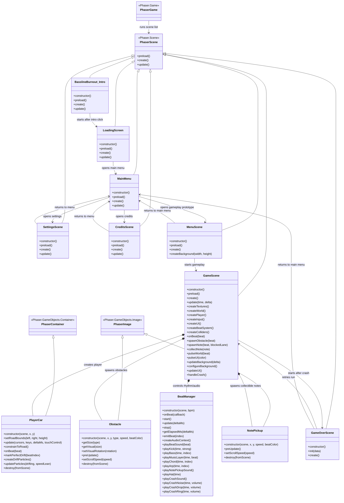

# Architecture

This diagram shows the main custom classes in our final game project and how they relate to Phaser-provided classes.

## Notes

All scene classes extend the Phaser-provided Phaser.Scene class.

BasslineBurnout_Intro, LoadingScreen, MainMenu, SettingsScene, and CreditsScene form the cinematic, title, settings, and credits flow.

MenuScene, GameScene, and GameOverScene form the gameplay prototype flow.

PlayerCar extends Phaser.GameObjects.Container because it combines the player car image, physics body, drift behavior, glow behavior, and particle effects into one reusable player object.

Obstacle extends Phaser.GameObjects.Image because obstacles now use image assets such as npc_car.png and npc_truck.png.

NotePickup extends Phaser.GameObjects.Image because collectible rhythm notes use note.png.

BeatManager is a custom helper class, not a Phaser scene. GameScene uses it to control beat timing, generated Web Audio music, note pickup sounds, crash sounds, and rhythm callbacks.

The diagram includes team-authored methods and important Phaser lifecycle methods we override, including preload(), create(), update(), and destroy().
